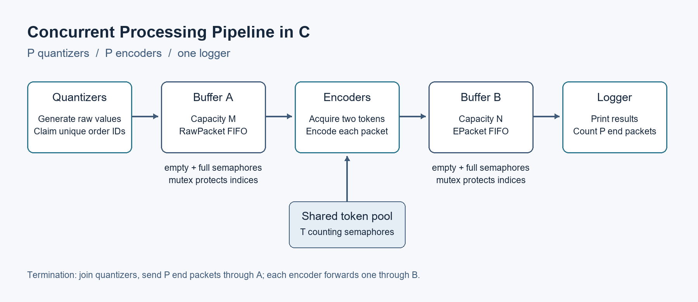

# Concurrent Processing Pipeline in C

A POSIX-threaded producer-consumer pipeline that simulates concurrent packet processing. Quantizers generate simulated packets, encoders transform them while sharing token resources, and a logger prints the results. Two bounded FIFO buffers connect the stages; mutexes protect shared state and counting semaphores coordinate available slots, packets and tokens.

The program uses a common token acquisition order to avoid circular waits and end packets to terminate after real work has been processed. Worker counts, buffer capacities and token assignments are configured on the command line. This repository contains my Question 1 implementation from a three-person project; Questions 2 and 3 were completed by teammates. Tests cover normal workloads, invalid input and selected failure paths.
## Features

- Concurrent quantizer, encoder and logger stages.
- Two bounded FIFO buffers protected by mutexes and counting semaphores.
- Shared token resources acquired in a consistent order to avoid circular waits.
- End packets that coordinate termination after all real work is processed.
- Input validation and cleanup for allocation, initialization and startup failures.

## Implementation



`P` quantizers share a protected counter and generate `num_orders` packets with IDs from zero to `num_orders - 1`. They write to Buffer A (capacity `M`). `P` encoders consume A, acquire their configured token pairs and write to Buffer B (capacity `N`). One logger drains B.

Raw values are random integers from 0 to 99. The assignment's encoding rule is:

```text
encoded_value = raw_value * 2 + token_A_ID + token_B_ID
```

Each buffer uses `empty` and `full` semaphores to reserve slots or packets and a mutex to protect its array and ring indices. Semaphore waits happen outside that mutex. The order counter and `rand()` calls share a separate mutex.

Encoders acquire the smaller token ID before the larger and release both before waiting for Buffer B. Distinct IDs and a common acquisition order prevent circular token waits; this does not guarantee fairness or bounded waiting. Equal token IDs are rejected.

After all quantizers finish, main sends `P` end packets to A. Each encoder forwards one end packet after its results and exits. The logger waits for all `P` end packets, and main joins every worker before releasing resources. A startup gate keeps partially created worker groups out of the buffers if thread creation fails. [Implementation notes](docs/implementation.md) explain these details and failure handling.

## Getting started

The intended environment is Linux with GCC, Make, POSIX threads and unnamed POSIX semaphores. Python 3 is needed for tests. From the repository root:

```bash
make
./pipeline 2 2 2 6 3 1 1 1 0 1 1 2
```

Arguments are supplied on the command line:

```text
./pipeline P M N num_orders T cnt_0 ... cnt_{T-1} tA_0 tB_0 ... tA_{P-1} tB_{P-1}
```

| Argument | Meaning and constraint |
| --- | --- |
| `P` | Positive worker count for each parallel stage |
| `M`, `N` | Positive buffer capacities within the platform semaphore limit |
| `num_orders` | Total workload, from 0 to `INT_MAX` |
| `T` | Number of token types, from 2 to `INT_MAX` |
| `cnt_i` | Positive instances of token type `i`, within the semaphore limit |
| `tA_i`, `tB_i` | Distinct token IDs from 0 to `T - 1` for encoder `i` |

All numbers must fit in a C `int`. The exact argument count and possible encoding overflow are checked. The program does not read standard input or an input file. More examples and failure behavior are in [implementation notes](docs/implementation.md).

## Example output

The first three lines of the saved six-order run are:

```text
[Logger] order_id=0, encoded_value=193
[Logger] order_id=1, encoded_value=55
[Logger] order_id=2, encoded_value=197
```

[Full sample output](examples/sample_output.txt) and its [recorded command](examples/README.md) are included. Random values and scheduling can change both values and log order; FIFO buffers do not imply ascending order IDs across stages.

## Testing

```bash
make test
make clean
```

The existing suite uses process timeouts and checks that every expected order ID appears exactly once. Cases include the four original Q1 configurations, capacity-one buffers, reversed token pairs, contention, empty workloads and invalid input. Optional GNU linker-wrapper tests exercise failure paths and the encoding formula.

[Recorded test results](docs/verification.md) describe the earlier MSYS2/GCC runtime checks and Linux cross-build. Native Linux execution and sanitizer runs were not completed, and the full concurrency suite was not rerun during this documentation cleanup. Native macOS and Windows toolchains are not assumed to support the required unnamed POSIX semaphores.

## Contributions and coursework context

I independently designed and implemented Question 1: the concurrent stages, bounded-buffer synchronization, token management, deadlock avoidance and termination mechanism. Questions 2 and 3 were implemented by my teammates and are not included here.

Validation, failure handling, tests and documentation were added later with AI coding assistance. [Change notes](docs/changes.md) distinguish those additions from the original coursework design. The group report, submission metadata and unused shared helpers are excluded.

## Limitations

This is a single-process educational simulation using synthetic arithmetic. Worker count and buffer capacities are fixed during each run. It has no fairness, real-time or performance guarantee; unexpected runtime synchronization failures terminate the process, and there is no checkpointing or cancellation API.
